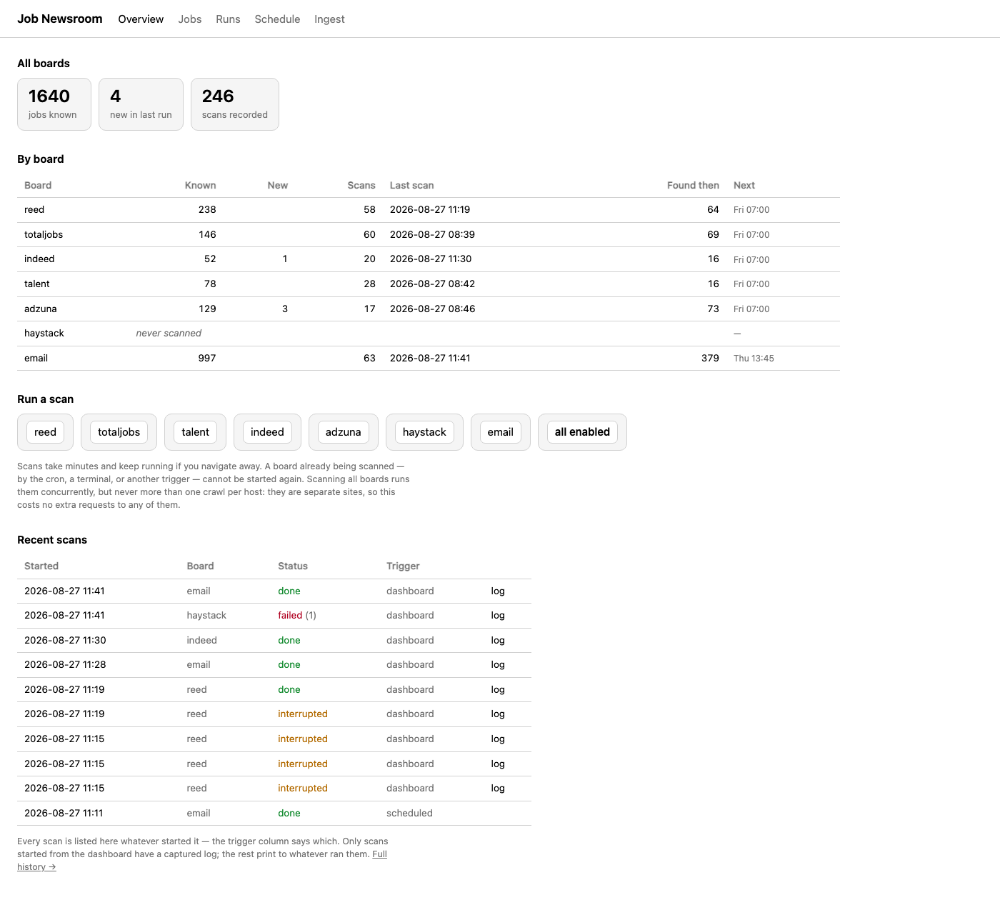
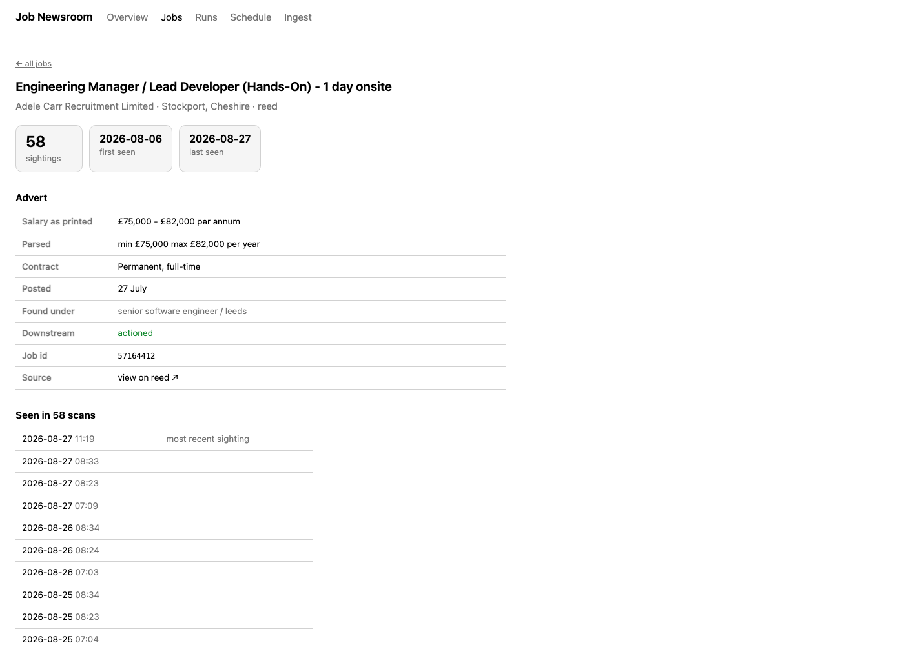
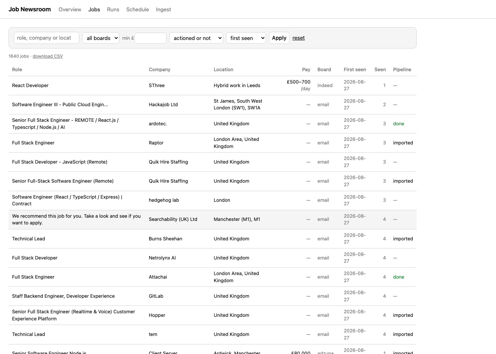
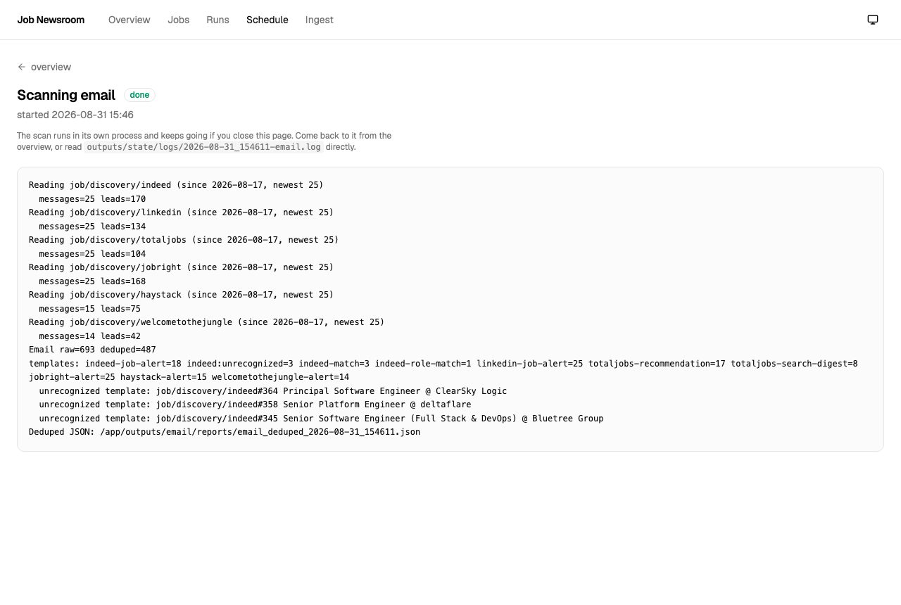
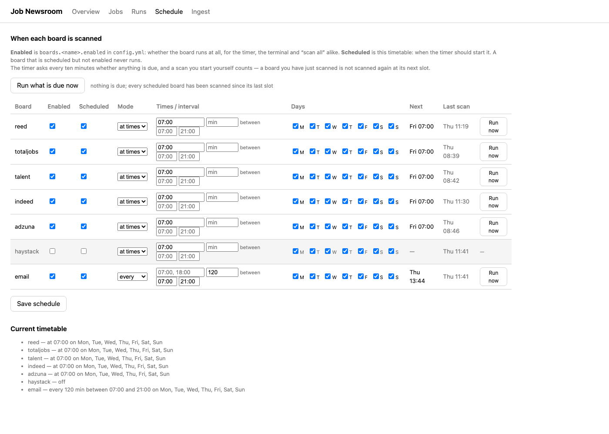
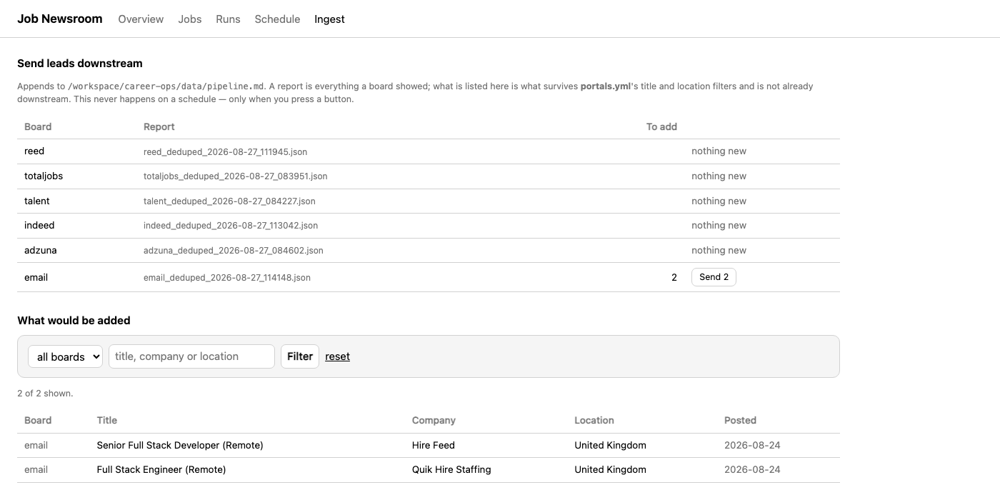
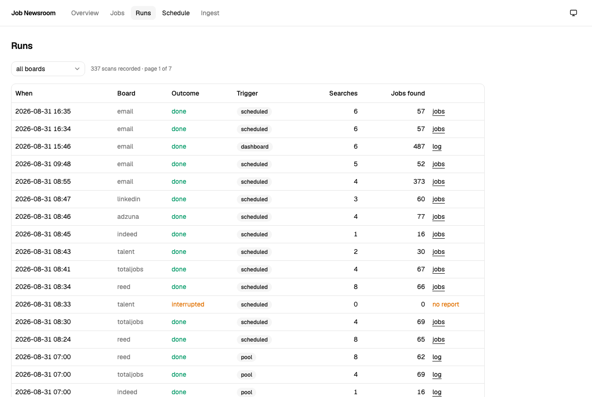

# Job Newsroom


[](https://github.com/unclecode/crawl4ai)
[](https://fastapi.tiangolo.com/)
[](https://react.dev/)


> A one-person newsroom for the job market

Eight sources file the same story every morning, in different words, with the tracking links
changed. Job boards render with JavaScript, rate-limit aggressively, wrap every posting in a
per-recipient URL, and never tell you what changed since yesterday.

Job Newsroom runs the desk. It collects from all eight, reconciles them into one story per job,
and shows you the edition: what is new, what has quietly disappeared, how long something has been
open, and what you have already dealt with.



```bash
docker compose up -d --build     # http://127.0.0.1:8080
```

## What you get

- **Eight sources, one config.** Reed, Totaljobs, Indeed, Talent.com, Adzuna, Haystack, LinkedIn and your Gmail alert labels, all driven from a single `config.yml`.
- **One story per job.** Every job appears once, with when it was first and last seen and how many editions have carried it.
- **Deduped across sources.** The same posting arriving as a Totaljobs magic link, a LinkedIn tracker and an Indeed click wrapper is one row, not four.
- **Structured pay.** Free text like `£70k - 85k per year` becomes a sortable minimum, maximum and period.
- **File from the browser.** Start a source and watch its output stream live; the run survives closing the page.
- **Slow by design.** Per-host request rates are bounded and delays jittered, so filing from eight sources at once costs no source extra traffic.
- **The list is what is worth opening.** Adverts the downstream filter would reject are hidden
  unless you ask for them, so the page and `/export.csv` answer the same question.
- **Honest failures.** A page that comes back empty is reported as a broken run, not as a search with no matches.

## The desk

| Page | What it answers |
| --- | --- |
| `/` | How is each source doing, and what shall I file? |
| `/jobs` | What is out there, and what have I not looked at? |
| `/jobs/<source>/<id>` | What is this advert, and how long has it been open? |
| `/runs` | Did anything break? |
| `/schedule` | When does each source file, and what is due? |
| `/ingest` | What is worth sending on? |
| `/export.csv` | Give me the current filter as a spreadsheet |

### One story, followed over time

Every sighting is kept, so a job accumulates a history rather than a timestamp. This one has been
open since the 6th of August and has appeared in 58 runs since.



### The wire

Jobs across all eight sources, filterable by source, pay floor, and whether they have already
reached your downstream workspace. Adverts the ingest would drop are hidden by default — **Show
skipped** brings them back, marked with the reason each was rejected.



### Filing live

Runs take minutes, so they happen in their own process and stream back to the page. Here the email
source reads four Gmail labels, recognises seven alert layouts, and reduces 567 raw leads to 379.



> [!NOTE]
> The three `unrecognized template` lines are the point, not a bug. A digest names one of its 25
> jobs in the subject, so attributing the subject to all of them would invent data. Unknown layouts
> are printed by id and subject instead, so a changed layout reads as work to do.

### The rota

Three files, each answering one question, and no scheduler that knows about the others.



### Sending leads on



### What broke



## How it works

```
                    ┌──────────────┐
   config.yml ─────▶│     run      │  one lock per source, jittered delays
                    └──────┬───────┘
                           │ writes, never overwrites
                           ▼
        outputs/<source>/raw/<search>__<stamp>.{md,html,json}   ← evidence
        outputs/<source>/reports/<source>_deduped_<stamp>.json
                           │
                           │ re-read on every request, no index
                           ▼
                    ┌──────────────┐
                    │  the desk    │──▶ overview · jobs · runs · schedule · ingest · CSV
                    └──────────────┘
```

Nothing is cached and nothing is precomputed. The dashboard reads the same report files the
collectors write, so it cannot disagree with them, and deleting the service loses nothing.

## Getting started

### With Docker (recommended)

```bash
git clone git@github.com:mike623/job-newsroom.git
cd job-newsroom
cp config.example.yml config.yml       # compose mounts it; the image never bakes it in

docker compose up -d --build
open http://127.0.0.1:8080
```

### Natively

```bash
python3 -m venv .venv
. .venv/bin/activate
python -m pip install -r requirements.txt

crawl4ai-doctor                        # installs and verifies the headless browser
cp config.example.yml config.yml

cd web && npm install && npm run build && cd ..   # the interface; Docker builds this for you

python -m dashboard                    # http://127.0.0.1:8080
python -m dashboard --reload           # restart on code changes
```

The interface is a React application in `web/`, built into `dashboard/static/` and served by
the dashboard itself — one process, one port, no node at runtime. It is not committed, so a
fresh checkout needs that one `npm run build`; until then the dashboard says so instead of
serving a blank page. Working on the interface, `npm run dev` gives hot reload on port 5173
and proxies its API calls back to the dashboard.

`config.yml` is gitignored — it holds your salary targets, locations and API credentials.

> [!IMPORTANT]
> The dashboard binds to loopback and has no host option. It can start runs, so it must not be
> reachable from the network.

## Configuration

Titles and locations are declared once in named groups, then referenced per source:

```yaml
search:
  titles:
    primary: [senior software engineer, backend developer]
  locations:
    core: [london, manchester]

boards:
  reed:
    enabled: true
    proxies: []             # egress identities; empty means one crawl at a time
    title_groups: [primary]
    location_groups: [core]
    proximity: 50
    max_pages_per_run: 8
```

Check what URLs your config produces without fetching anything:

```bash
python reed_crawler/board_config.py
```

> [!WARNING]
> The low `max_pages_per_run` and multi-second `delay_seconds` defaults are deliberate. Job boards
> block scrapers that move quickly. Raise them gradually and expect to be blocked if you don't.

## The sources

| Source | Read from | Notes |
| --- | --- | --- |
| **Reed** | Markdown headings | Full field coverage; the most reliable source |
| **Totaljobs** | Markdown cards | Anchored on the card's `more` line |
| **Indeed** | HTML | Card links are click wrappers with no job id; the HTML has one |
| **Talent.com** | Markdown cards | Needs a seed result `id` to hydrate — see below |
| **Haystack** | HTML | A client-rendered SPA; fields are anchored on their icons — see below |
| **Adzuna** | JSON API | Not crawled at all: the site 403s every bot. Needs free API credentials |
| **LinkedIn** | Guest endpoint | Not crawled at all: an unauthenticated HTML fragment — see below |
| **Email** | Gmail labels | Not crawled at all: reads the alert mail the sources already send |

Four of the eight are not crawls, and that is the interesting part.

### Adzuna reads an API

`adzuna.co.uk` sits behind CloudFront, which answers every automated request with a bare 403 —
curl and headless Chromium alike, whatever user agent is offered. There is no markup to parse, so
this source reads Adzuna's [JSON search API](https://developer.adzuna.com/) instead. Register free,
then:

```yaml
boards:
  adzuna:
    enabled: true
    app_id: "..."          # or export ADZUNA_APP_ID
    app_key: "..."         # or export ADZUNA_APP_KEY
    distance: 30           # kilometres
    results_per_page: 50   # the API's maximum
```

Credentials are attached at request time only, so no capture, report or log line ever contains the
key. Pay arrives as numbers rather than advertiser prose — where `salary_is_predicted` is set, the
figure is Adzuna's own estimate and says so.

### LinkedIn reads a guest endpoint

LinkedIn publishes no job-search API you can get a key for, and its logged-in search does not
welcome automation. It does answer one URL unauthenticated —
`/jobs-guest/jobs/api/seeMoreJobPostings/search` — with a plain HTML fragment of result cards. No
login, no JavaScript, no browser.

```yaml
boards:
  linkedin:
    enabled: true
    distance: 30           # miles
    max_age_days: 7        # without this, page one carries adverts eight months old
    pages_per_search: 2    # ten cards a page
```

Off by default on purpose: the endpoint throttles by IP, and being blocked here also costs you the
LinkedIn alert mail the email source reads. Keep `delay_seconds` generous.

The endpoint's parameters, its paging rule and the card selectors are adapted from
[JobSpy](https://github.com/speedyapply/JobSpy) (MIT) and vendored rather than imported — the forty
lines that encode what LinkedIn does are worth having; its pandas-shaped model layer is not.

UK cards state no salary, so that column stays empty here. The same posting often arrives twice —
once from this source, once as a LinkedIn alert mail — and both are kept, because they are two
genuine sightings of one advert.

### Email reads your mailbox

The sources already email their alerts, so this one reads them rather than asking for the same jobs
twice. It needs the [`himalaya`](https://github.com/pimalaya/himalaya) CLI configured against the
account (`brew install himalaya`, then run `himalaya` once):

```yaml
boards:
  email:
    enabled: true
    messages_per_label: 25   # newest N per label per run
    max_age_days: 14
    mark_read: false         # flag mail that produced leads, so a rerun skips it
    labels:
      - label: job/discovery/indeed
        provider: indeed
      - label: job/discovery/linkedin
        provider: linkedin
```

Three axes stay separate. The **label** says which mailbox to read; the **sender** decides which
provider's URL rules apply, because mail filed by hand lands under the wrong label; and a **body
signature** picks the template that knows that sender's current layout.

Per-recipient links are stripped before a lead is kept. Totaljobs wraps a posting in a magic-link
JWT, LinkedIn and Jobright append per-email tracking, Welcome to the Jungle signs the recipient
in with a `?token=<JWT>` on the posting itself, and Totaljobs digests and every Welcome to the
Jungle link go through trackers (`totaljobsmail.com`, `ct.sendgrid.net`) resolved by reading
`Location` headers only. Indeed's `cts.indeed.com`
wrappers are decoded locally — the destination is a gzipped blob inside the link, and Indeed blocks
automated traffic hard. Untouched, one posting yields a different URL in every mail and dedup never
fires.

### Haystack is a SPA

haystack.cv renders a whole card as one link whose text runs title, company, location, salary and
posted date together with no separator, so markdown cannot recover the fields. It is parsed from
HTML instead, anchored on the lucide icon that labels each one (`lucide-building2` → company,
`lucide-map-pin` → location). The surrounding utility classes are generated and will churn; the icon
names are the stable part.

> [!NOTE]
> An empty Haystack run can be the site, not the parser. Its search backend intermittently answers
> "Something went wrong loading jobs" on an otherwise healthy page; the run retries once and then
> records zero leads.

### Talent.com needs a seed

Talent.com can return an unhydrated shell. Supplying a live result `id` forces the list to render:

```yaml
boards:
  talent:
    max_pages_per_run: 2
    delay_seconds: 60
    search_params:
      - k: Senior Software Engineer
        l: london
        id: "611275213865225891"   # seeds hydration
```

It rate-limits harder than the others; keep the volume low.

## The command line

The dashboard is a convenience; every run is a plain script.

```bash
python reed_crawler/scan_all.py --config config.yml [--limit N]   # every enabled source
python reed_crawler/scan_all.py --due --config config.yml         # only what the rota says is due

python reed_crawler/run_reed_scan.py --config config.yml [--limit N]
python reed_crawler/totaljobs_pipeline.py scan --config config.yml [--limit N]
python reed_crawler/talent_pipeline.py scan --config config.yml --limit 1
python reed_crawler/haystack_pipeline.py scan --config config.yml [--limit N]
python reed_crawler/indeed_pipeline.py scan --config config.yml [--allow-disabled]
python reed_crawler/adzuna_pipeline.py scan --config config.yml [--allow-disabled]
python reed_crawler/email_pipeline.py scan --config config.yml [--allow-disabled] [--mark-read]
```

`scan_all.py` takes its source list from `boards.<name>.enabled`, so turning one on or off is a
config edit rather than a change to the cron. `--limit N` caps the search pages for one run.

Every run takes its source's lock, so the timer, a terminal and the dashboard stay out of each
other's way. A run that finds the source busy exits **75**; one where no search returned a usable
page exits non-zero.

## Scheduling

```bash
python reed_crawler/install_timer.py --install     # a launchd agent, every 10 minutes
```

It runs `scan_all.py --due` and nothing else. What that files is decided by three files, each
answering one question, so **changing the rota never means touching launchd again**:

| | |
| --- | --- |
| `config.yml` | *may* this source run at all |
| `outputs/state/schedule.json` | *when* should it run |
| `outputs/state/runs.json` | *when did* it last run |

Edit the middle one on the Schedule page. Each row has two boxes and they mean different things:
**Enabled** is `boards.<name>.enabled` — whether the source runs at all, for the timer, the terminal
and "all enabled" alike — and **Scheduled** is the rota. A source that is scheduled but not enabled
never runs.

The same page files by hand: **Run now** on any enabled source, and **Run what is due now**, which
asks the very question the timer asks rather than something that merely resembles it.

A few behaviours worth knowing:

- A slot belongs to its own day. Three missed mornings produce one run, not three.
- A run you started yourself counts — the rota asks that a source be scanned, not that the timer do it.
- A *busy* run does not count, because it never asked the source anything. A *failed* one does: retrying every ten minutes is the worst possible response to a source that has begun blocking you.

> [!NOTE]
> launchd rather than cron: the email source reads its Gmail password from the login keychain,
> which needs your session, and launchd runs a missed interval after the machine wakes where cron
> simply skips it.

## Sending leads downstream

A report is everything a source showed; `ingest_jobspy.py` decides what is worth opening and appends
it to the career-ops pipeline:

```bash
python reed_crawler/ingest_jobspy.py --latest email --dry-run   # print, write nothing
python reed_crawler/ingest_jobspy.py --latest email
```

Relevance is defined downstream on purpose. It comes from **career-ops/portals.yml** — the same
`title_filter` and `location_filter` its own scanner uses — so this project never holds a second
opinion about which jobs matter. Rows already in `data/pipeline.md` or `data/scan-history.tsv` are
skipped, as is one req posted to several cities.

The Ingest page is that same dry run, drawn: a row per source with what it would append, and a
table of the individual jobs, each carrying the exact pipeline line it will become. Filtering
narrows what you read, never what is sent — ingest appends a whole report, so the buttons always
state the full count. A source whose newest report changed since the preview was drawn is
skipped rather than appended unseen.

> [!IMPORTANT]
> The downstream workspace is written to only when a person asks. `ingest_jobspy.py` is its sole
> writer, reachable from the terminal or the Ingest page and never from the scheduler. A test
> asserts nothing under it is modified.

## Docker

```
timer     ──POST /scan-due──▶  runner  ──spawns──▶  the sources
dashboard ──POST /scan/…────▶  runner
dashboard ──reads outputs/──▶  history, status, live logs
```

**The runner** is the only thing that starts a run, and it has no published port — every one of its
endpoints begins a crawl, so it is reachable from the compose network and nowhere else. **The
dashboard** asks it (`RUNNER_URL`) instead of spawning, and keeps reading `outputs/` directly for
everything else. **The timer** is four lines of `curl` in a loop; it needs no Docker socket and no
privileges, because triggering a run is an HTTP request rather than a process to spawn. Point
ofelia, a host cron, or a Kubernetes CronJob at `POST /scan-due` instead and nothing else changes.

### Why only one runner

`scan_lock` decides whether a source is already being scanned by signalling the pid that wrote the
lock. That answer is only true inside the namespace owning the pid, so two containers that both
spawn runs would each read the other's live lock as stale and scan the same source twice — doubling
the request rate that every delay in the collector exists to avoid. One spawner keeps the lock
honest; everyone else asks it.

Following a run needs no such care. The run record and the log are files under `outputs/`, so the
dashboard streams a run it did not start straight off the shared volume.

> [!CAUTION]
> Do not run the containers and a native install against one `outputs/`. A container pid means
> nothing to a native process, so both would scan the same source at once.

### Volumes

```yaml
    volumes:
      - ./outputs:/app/outputs      # data — everything a run produces
      - ./config.yml:/app/config.yml
      - .:/app                      # convenience — the checkout over the image's copy
```

`outputs/` is **never copied into the image** (`.dockerignore` skips it). Every report, raw capture,
run record, lock and log is written straight through to the checkout, so the containers hold no
state of their own and can be destroyed and rebuilt without losing a run.

The third line is separate on purpose. It puts the working tree over the image's copy of the source,
so editing a collector takes a `docker compose restart <service>` rather than a rebuild — but the
running container is then no longer what the image says it is. Delete that one line to run the image
exactly as built; the two data mounts above are what must stay.

One `Dockerfile`, two targets. Both share every Python dependency; they differ only in Chromium,
which the runner needs and the dashboard never launches — 2.38GB for the runner against 996MB for
the dashboard, with the shared layers stored once. Chromium is installed before any source is
copied, so editing code rebuilds only the last layer of each target.

### The email source in a container

It works, but it needs the one thing a container cannot inherit from macOS: your keychain. The
runner image carries a Linux `himalaya` and reads the password from a file instead:

```bash
mkdir -p secrets
cp secrets/config.example.toml secrets/config.toml    # fill in your address
security find-generic-password -a YOU@gmail.com -s himalaya-gmail-app-password -w > secrets/password
chmod 600 secrets/config.toml secrets/password
```

`./secrets` is mounted read-only at `/run/himalaya`, `HIMALAYA_CONFIG` points at it, and both files
are gitignored and excluded from the build context — nothing is baked into the image, and nothing is
passed as an environment variable, which `docker inspect` would print.

> [!CAUTION]
> A Gmail app password is full IMAP and SMTP access to the whole account, not scoped to the job
> labels. In the keychain it needs your session to read; in a file it does not. Treat the machine
> holding `secrets/` accordingly, and revoke the password at myaccount.google.com if it is ever
> exposed.

Without those files the source fails at run time with himalaya's own error and the other six are
unaffected — the container still starts.

### The downstream workspace

`career-ops` lives outside this repo, so the dashboard mounts it explicitly:

```yaml
      - ${CAREER_OPS_DIR:-../career-ops}:/workspace/career-ops   # dashboard only
```

with `CAREER_OPS_WORKSPACE=/workspace/career-ops` naming it inside. Set `CAREER_OPS_DIR` if your
checkout is not a sibling of this one.

It is mounted on the **dashboard and not the runner**, which makes the rule that no schedule may
write downstream a physical fact rather than a convention: the container that scans cannot reach
`pipeline.md` at all, however a run is triggered.

### The rest

- **The published port binds `127.0.0.1`.** Inside the container the dashboard listens on `0.0.0.0` (`DASHBOARD_HOST`) because a container's own loopback is reachable by nothing; the port publication is what keeps it private. Changing it to `8080:8080` puts a run trigger on your LAN.
- **`JOB_CRAWLER_TIMER` names the timer.** Without it the Schedule page looks for launchd, does not find it, and warns that nothing is reading the rota.
- **Natively there is no runner.** With `RUNNER_URL` unset the dashboard starts runs in-process, exactly as before. Both paths end in the same code; only the transport differs.
- **Podman works too** — `podman-compose up -d` — with no changes to the compose file.

## Outputs

Everything runtime lands under `outputs/`, which is gitignored:

```
outputs/<source>/raw/        page captures, one set per run
outputs/<source>/reports/    timestamped JSON per stage
outputs/state/locks/         which source is being scanned
outputs/state/runs.json      every run, whatever started it
outputs/state/logs/          their output
outputs/state/schedule.json  the rota
```

Report filenames are a contract: `<source>_<stage>_<YYYY-MM-DD>_<HHMMSS>.json`. Captures carry the
run stamp, so runs accumulate rather than overwrite, and a capture can be matched to the report
written beside it. When a parser starts returning nothing — usually a site changing its markup —
those captures are what you diff.

## Testing

```bash
python -m pytest                          # 316 tests, no network required
python -m py_compile reed_crawler/*.py dashboard/*.py runner/*.py
```

> [!NOTE]
> Tests assert against `config.example.yml`, not your personal `config.yml`. Adding a config key
> means adding it to both.

## Troubleshooting

**A run reports `empty-body`.** The fetch succeeded but the page had nothing in it — usually
transient, occasionally a block. The capture is still written; check it for a consent wall or a
CAPTCHA. If every search in a run does this, the run exits non-zero.

**A run exits 75.** The source is already being scanned, by the timer, a terminal or the dashboard.
Nothing is wrong; wait for the other one.

**A source returns zero jobs with a healthy page.** The parser needs updating for changed markup.
Diff the newest capture in `outputs/<source>/raw/` against an older one.

**Crawls hang.** Run `crawl4ai-doctor`, then set `crawl.headless: false` to watch the browser and
see where it stalls.

The `probe_*.py` scripts are standalone single-URL crawls for testing a source in isolation. Modules
marked `SUNSET` at the top are kept for reference and are not wired to anything.
